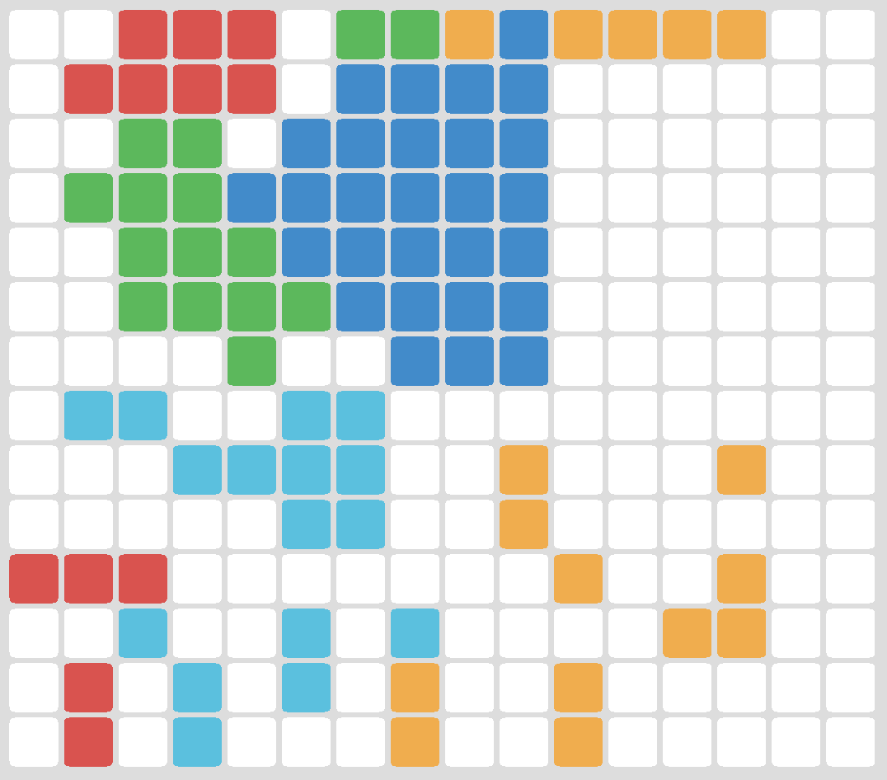

## Rules

 * Two phases: Placement & Growth
 * Players place a single tile during Placement phase
 * Growth phase begins when all players have placed their tiles
 * Placement phase begins after Growth phase is completed
 * First to own all tiles wins

### Placement

 * A tile may be placed within 2 tiles of the player's territory

### Growth

 * If a tile is surrounded by 3 tiles belonging to a player, that tile will belong to that player

## TODO

 * Detect winning conditions
 * Somewhere to write status ("make a move, yo!", "you win!")
 * Prevent stalemate

